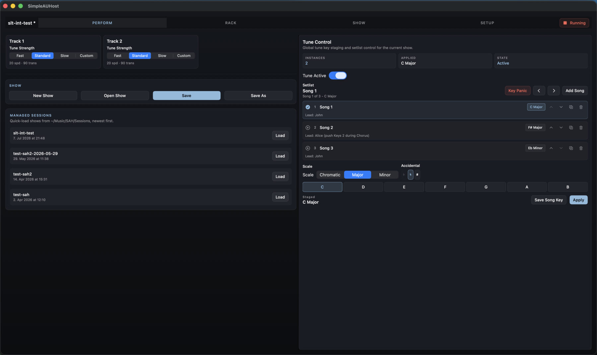
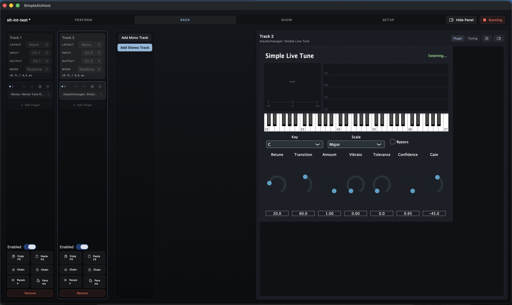
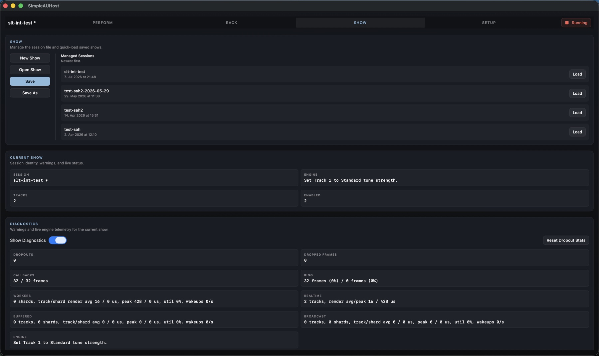
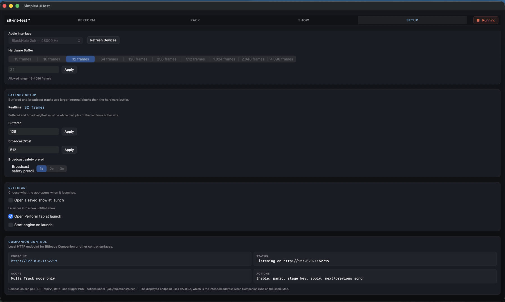

# Complete User Guide

This guide covers the complete SimpleAUHost app workflow. It is written for both the person who prepares the audio system and the person who runs a show.

## Core concepts

### Shows

A show is the complete saved working state:

- selected audio interface and hardware buffer;
- buffered and broadcast processing sizes;
- mono/stereo tracks and enabled state;
- input and output routing;
- latency class per track;
- ordered Audio Unit chains and saved plugin state;
- tune enabled state, applied/staged key, setlist, song notes, and per-track tune strength.

Show files use `.sahsession`. Managed shows live in `~/Music/SAH/Sessions`.

### Tracks and exclusive outputs

Each enabled track reads one mono channel or two consecutive stereo channels. It writes to one mono output or a consecutive stereo pair.

Enabled tracks may share input channels, but they may not share output channels. SimpleAUHost validates exclusive outputs before starting because it does not sum tracks at the final hardware output.

### Engine state

The top-right **Stopped/Running** button starts and stops the shared audio engine. Device selection, routing, track structure, insert selection, latency sizes, and similar structural changes are locked while running. Live plugin parameters, tuning controls, setlist selection, and saving remain available.

If startup validation fails, the app presents the complete list of problems to correct.

## Perform



Perform is the normal operator workspace. It combines per-track tune strength, global tune and setlist controls, and quick show-file actions.

### Tune track cards

A card appears for every track containing a recognized Waves Tune Real-Time or Simple Live Tune insert. A disabled track is marked **Off**.

Each card has these strength choices:

| Choice | Behavior |
| --- | --- |
| **Fast** | Stronger/faster correction using a predefined speed and transition pair. |
| **Standard** | General-purpose predefined correction. |
| **Slow** | More gradual predefined correction. |
| **Custom** | Leaves the tuner’s current speed and transition values unchanged. |

When the engine is running, Fast/Standard/Slow are applied directly to supported tuner instances on that track. When stopped, the choice is saved and applied at the next start. If live parameter values do not match a preset, the app reports Custom.

### Global tune control

The summary cards show:

- **Instances** — recognized tuner inserts on enabled tracks;
- **Applied** — the key currently regarded as active;
- **State** — Active or Bypassed.

**Tune Active** bypasses or enables all recognized running tuner instances. The state is also stored with the show.

### Build and edit a setlist

Choose **Add Song**, enter a name, and choose Chromatic, Major, or Minor plus a supported root. The new song is appended and selected.

Each song row supports:

- select/apply with the play/check icon or key button;
- edit the title and free-form notes;
- move up or down;
- duplicate directly after the source song;
- remove.

Selecting a song immediately copies its saved key to both Staged and Applied. If the engine is running, the key is sent to all recognized tuner instances. The previous/next buttons stop at the beginning and end of the list; they do not wrap.

Song and setlist edits are show changes. Save the show to retain them.

### Stage and apply a key

The key controls let you prepare a change without applying it:

1. Choose Chromatic, Major, or Minor.
2. Choose a note letter and a valid flat/natural/sharp spelling.
3. Confirm the value shown under **Staged**.
4. Choose **Apply** to make it active on all supported tuners.

Choose **Save Song Key** to replace the selected song’s key with the staged value. Saving a song key also selects and applies that song.

Chromatic ignores the displayed root operationally. Unsupported spellings such as C-flat, E-sharp, F-flat, and B-sharp are not selectable.

### Key Panic

**Key Panic** immediately changes the active scale to Chromatic while preserving the currently applied root internally. Use it when a wrong diatonic key is causing obviously incorrect correction. It does not bypass tuning.

### Show actions and managed sessions

Perform includes the same main show actions as Show:

- **New Show** resets to a new untitled show.
- **Open Show** loads a `.sahsession` from any accessible location.
- **Save** updates the current file, or opens Save As for a new/template show.
- **Save As** writes a new show file.
- **Load** beside a managed session opens a file from `~/Music/SAH/Sessions`.

New, Open, and managed-session Load are disabled while the engine is running. Unsaved changes require confirmation before replacement.

## Rack



Rack is where the technical show configuration is built.

### Add and configure tracks

Use **Add Mono Track** or **Add Stereo Track**. Every track strip provides:

- editable track name;
- **Layout** — Mono or Stereo;
- **Input** — starting hardware input channel;
- **Output** — starting hardware output channel;
- **Mode** — Realtime, Buffered, or Broadcast/Post;
- calculated latency readout;
- **Enabled** switch.

Stereo selections consume the displayed start channel and the following channel. Invalid routes are highlighted. Changing layout may cause channel selections to be clamped to valid ranges.

Use **Remove** to delete a track. A new show always retains at least one track.

### Build an insert chain

1. Choose **Add Plugin** to append an insert.
2. Click the insert’s selector.
3. Search the discovered Audio Unit list and choose a plugin.
4. Repeat to build the chain in signal-flow order.

Each insert provides:

- up/down arrows to change processing order;
- a pop-out editor button for a loaded plugin;
- remove;
- a plugin selector, including Empty.

Track structure and insert choices can be changed only while stopped.

### Embedded and pop-out editors

Select a track and insert, start the engine, and leave the inspector in **Plugin** mode to embed the live Audio Unit editor. The editor is unavailable while stopped because no live instance exists.

The upper-right inspector buttons let you:

- switch between **Plugin** and compact **Tuning** control;
- pop out the current plugin editor or Tune Control;
- close the inspector.

Use **Show Panel** in the workspace toolbar to restore a closed inspector.

Plugin parameters changed through the live editor are captured when the show or a preset is saved.

### Copy and paste processing

**Copy FX** stores the source track’s complete insert list and plugin states in memory. **Paste FX** replaces the destination track’s processing with a fresh copy of that list.

Paste is available only while stopped. The copied processing is temporary and exists only in the running app; use a chain preset for reusable storage.

### Chain presets

The two **Chain** buttons save and load `.sahchain` files in:

```text
~/Music/SAH/Chain Presets
```

A chain preset contains the track layout requirement, complete insert order, plugin identities, and saved plugin state. Loading replaces the destination track’s entire chain. Mono presets require a mono destination and stereo presets require stereo.

### Parameter presets

The two **Params** buttons save and load `.sahparams` files in:

```text
~/Music/SAH/Parameter Presets
```

A parameter preset stores plugin state without replacing the chain. The destination must have the exact same non-empty plugins in the exact same order. This makes parameter presets suitable for alternate settings of one established chain.

Parameter state can be saved and loaded while running. The app reports plugins that reject live state restoration.

### Tuning inspector

Switch the Rack inspector to **Tuning** for the same global tune and editable setlist controls used in Perform. The pop-out button opens Tune Control in a floating utility window, useful when adjusting plugins and tuning side by side.

## Show



Show combines file management with a technical health view.

### Show-file management

The top panel contains New, Open, Save, Save As, and all managed sessions sorted newest first. See [Show actions and managed sessions](#show-actions-and-managed-sessions) for their behavior.

The current show panel displays:

- session name and unsaved `*` marker;
- latest engine/status message;
- total track count;
- enabled track count.

### Warnings

Show lists current session warnings, including invalid input/output spans and overlapping output ownership. Treat warnings as blockers for a reliable show even when they concern a currently disabled path that may later be enabled.

### Diagnostics

Enable **Show Diagnostics** to publish and display live telemetry:

| Metric | Meaning |
| --- | --- |
| **Dropouts** | Engine underrun/overrun events detected by the host. |
| **Dropped Frames** | Frames lost during those events. |
| **Callbacks** | Observed input/output hardware callback frame sizes. |
| **Ring** | Peak input/output ring-buffer occupancy. |
| **Workers** | Background worker shard count, render time, utilization, and wakeups. |
| **Realtime** | Realtime track count and render average/peak. |
| **Buffered** | Buffered track/shard load and timing. |
| **Broadcast** | Broadcast/Post track/shard load and timing. |
| **Engine** | Latest human-readable status. |

**Reset Dropout Stats** clears accumulated dropout and dropped-frame counters.

Diagnostics publishing is active only while Show is selected, diagnostics are visible, and the engine is running. This avoids unnecessary UI telemetry work during normal Perform operation.

## Setup



### I/O setup

All tracks share one **Audio Interface**. The picker shows the interface sample rate. Use **Refresh Devices** after connecting, disconnecting, or reconfiguring hardware.

Choose a supported hardware buffer from the presets or enter a custom frame count within the displayed allowed range. Smaller buffers reduce latency but leave less processing time; larger buffers increase stability and latency.

Device and buffer changes require the engine to be stopped.

### Latency classes and internal buffers

Each track uses one execution strategy:

| Class | Processing behavior | Typical use |
| --- | --- | --- |
| **Realtime** | Runs on the hardware callback cadence. | Live pitch correction, monitoring, latency-sensitive effects. |
| **Buffered** | Runs on a background worker in larger blocks. | Heavier effects where some added latency is acceptable. |
| **Broadcast/Post** | Uses a larger worker block plus configurable safety preroll. | Stream, record, mastering, or post paths that favor resilience over immediacy. |

Realtime block size always equals the hardware buffer. Buffered and Broadcast/Post sizes must be whole multiples of the hardware buffer. Their values must also be at least one hardware buffer.

**Broadcast safety preroll** chooses 1x, 2x, or 3x of the Broadcast/Post internal block. More preroll adds safety and latency.

The latency readout in Rack includes the selected buffering strategy and reported plugin latency. Always validate timing in the real signal path; plugin look-ahead can add latency beyond the host buffers.

### Choosing buffer values

A practical starting point is:

- hardware: 32–64 frames for live monitoring, or 96–192 when stability is more important;
- buffered: 2x–4x the hardware buffer;
- broadcast: 4x–16x the hardware buffer;
- broadcast preroll: 1x, increasing only if that path needs more protection.

These are starting points, not guarantees. Plugin cost, channel count, interface drivers, and the Mac determine stable values. Use Show diagnostics during a realistic rehearsal.

## Startup and template workflows

Setup can automate recurring events.

### Start with a new show

Leave **Open a saved show at launch** off. The app starts with an untitled show.

### Open the last saved show

1. Enable **Open a saved show at launch**.
2. Choose **Last Saved Show**.

The most recently saved show path is remembered. If that file moves or is deleted, Setup displays a warning.

### Open a specific show

1. Enable **Open a saved show at launch**.
2. Choose **Specific Show**.
3. Choose **Choose Show** and select a `.sahsession`.

Use **Clear** to remove the saved path.

### Protect a prepared show as a template

Enable **Open selected show as template** for a specific startup show. At launch, its complete configuration loads, but it has no current save target. Therefore **Save** opens Save As and cannot overwrite the source template accidentally.

A good recurring-event workflow is:

1. The administrator maintains `Venue Template.sahsession`.
2. The operator launches into that template.
3. The operator updates the event setlist.
4. The operator saves a dated copy such as `Sunday 2026-08-02.sahsession`.

### Open Perform and start automatically

- **Open Perform tab at launch** skips directly to the operator workspace.
- **Start engine on launch** attempts to start after the startup show has loaded.

Automatic start still performs normal permission, device, routing, buffer, and plugin validation. For unattended operation, thoroughly rehearse the exact saved show and hardware state first.

## Saving, loading, and unsaved changes

An asterisk next to the show name means the in-memory show differs from the saved file.

- Loading another show or creating a new one asks before discarding unsaved work.
- Closing the main window or quitting asks whether to save or discard unsaved work.
- Saving while running captures current live plugin states first.
- Loading, New Show, structural edits, and most setup changes require the engine to be stopped.

If a loaded show references an unavailable audio-device UID, SimpleAUHost reports the missing interface and offers Retry after the device is connected.

## Supported centralized tuning plugins

### Waves Tune Real-Time

Waves Tune Real-Time is a separately installed and licensed commercial Audio Unit. SimpleAUHost recognizes it and controls:

- bypass;
- Scale Root;
- Scale Type;
- Tune Speed;
- Note Transition.

The centralized controls modify parameters directly; they do not depend on plugin scenes or snapshots.

### Simple Live Tune

Equivalent bypass, key, scale, retune-speed, and note-transition mapping exists for [Simple Live Tune](https://github.com/staubichsauger/simple-live-tune). That plugin is still in development and is not currently available as an end-user release.

Other Audio Units can be hosted normally in Rack but do not appear as centralized tuning instances.

Waves and Waves Tune Real-Time are trademarks of Waves Audio Ltd. SimpleAUHost is independent and is not affiliated with, sponsored by, or endorsed by Waves Audio Ltd.

## File locations and extensions

| Content | Default folder | Extension |
| --- | --- | --- |
| Shows | `~/Music/SAH/Sessions` | `.sahsession` |
| Chain presets | `~/Music/SAH/Chain Presets` | `.sahchain` |
| Parameter presets | `~/Music/SAH/Parameter Presets` | `.sahparams` |

The files are human-readable, versioned JSON, but normal editing should be done in the app. Back up the entire `~/Music/SAH` folder to preserve shows and presets.

## Companion

The local API starts with the app and listens at `http://127.0.0.1:52719`. It is intended for Companion running on the same Mac. See [Bitfocus Companion and Stream Deck](companion.md) for module installation, actions, feedbacks, variables, and API details.
